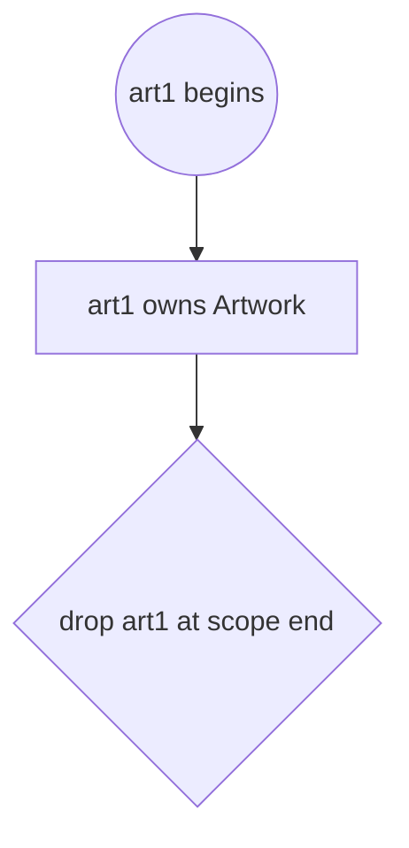
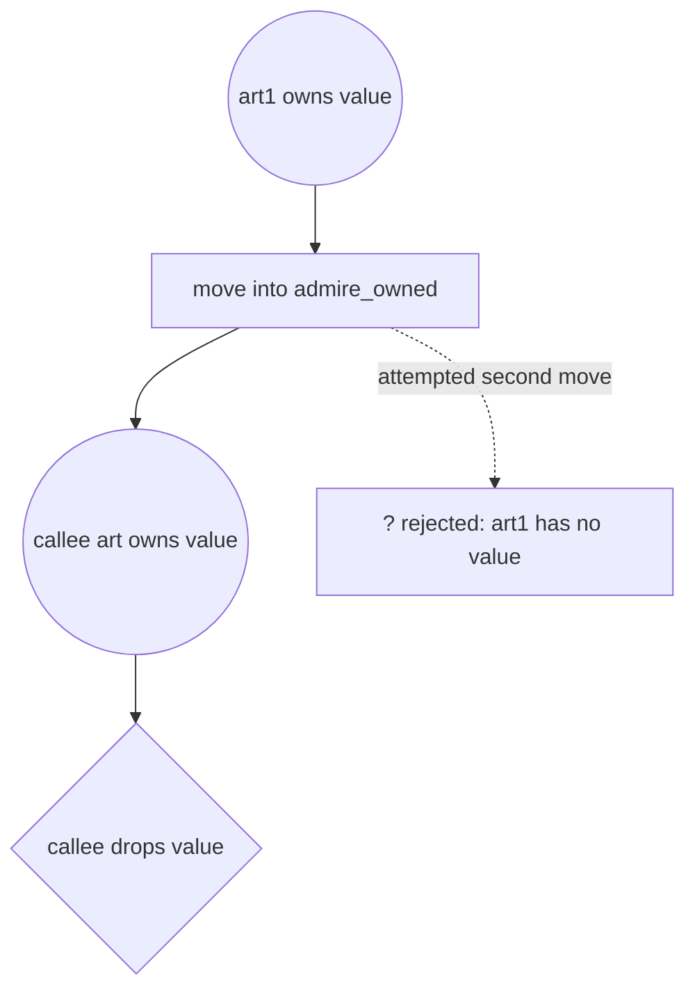
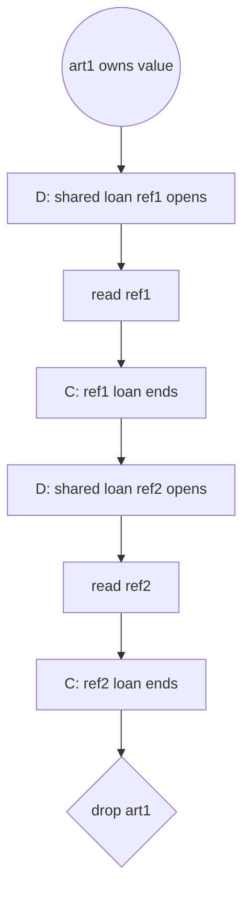
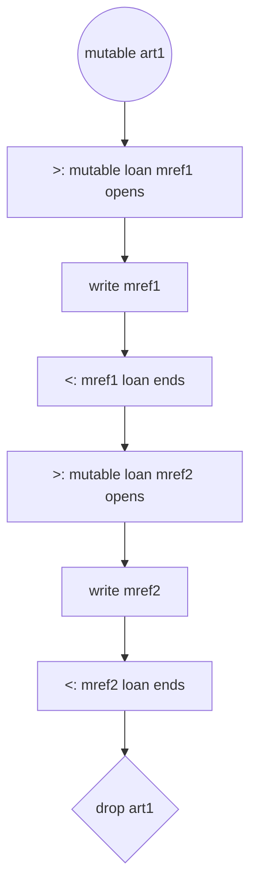
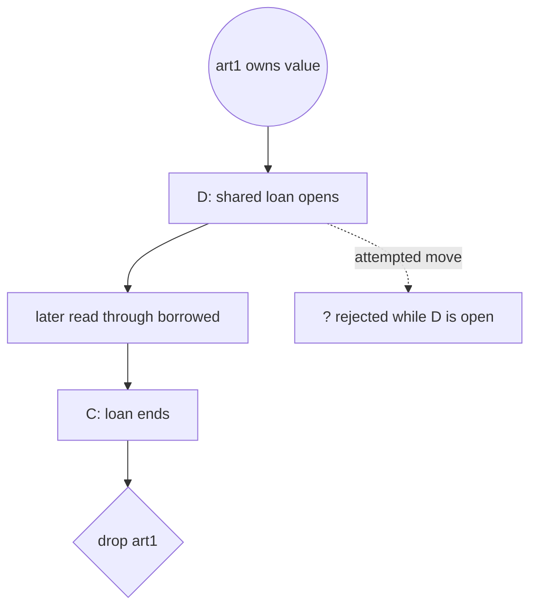
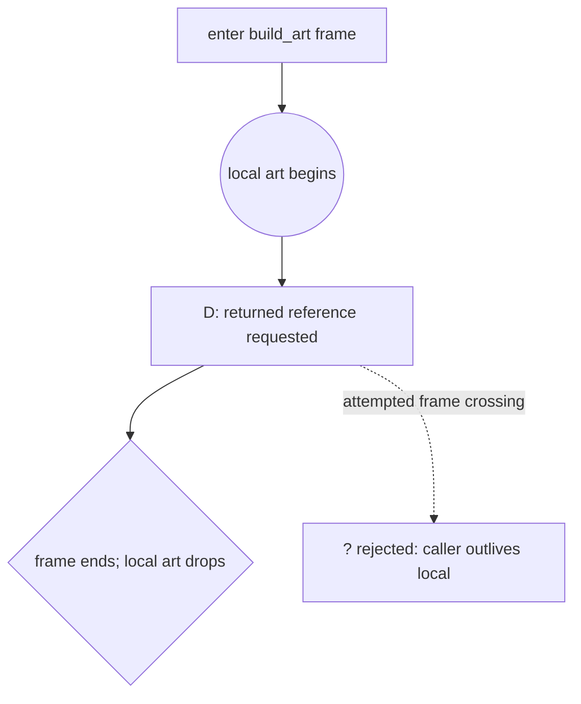
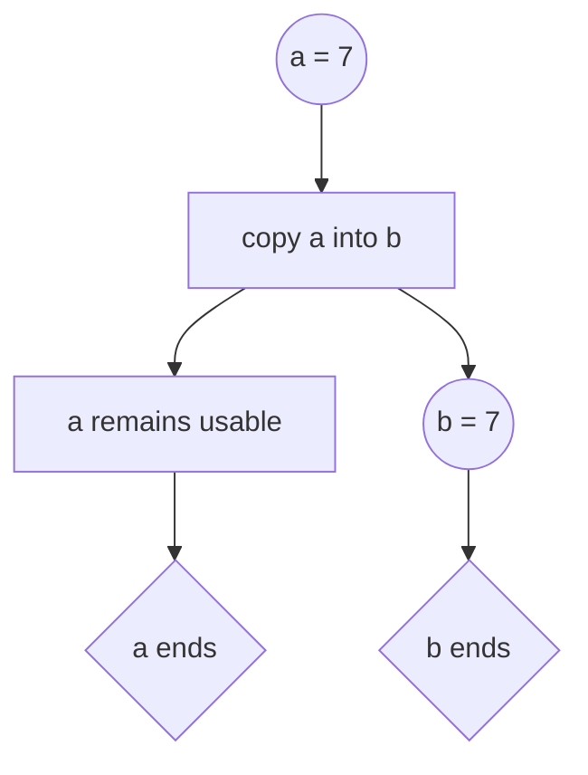

# Candidate B: Mermaid lifeline graph

Candidate B replaces the T-table body with ordinary Mermaid `flowchart`
diagrams. Each binding, operation, and end point is a simple node; edges show
how permission or ownership proceeds down the page. The diagrams need one ink
color, and their text labels carry all meaning. This material has not been
tested with learners.

## Marks

| Concept | Simple node or edge |
|---|---|
| Allocation | a round start node |
| Live owned value and lifetime | solid edges between operations |
| Move | an edge from the old owner to the new owner; the old path ends |
| Copy | one node branches to two continuing owned paths |
| Borrow | a `D` open node and `C` close node |
| Mutable borrow | a `>` open node and `<` close node |
| Reference binding | a labelled reference node |
| Loan ends | `C` or `<`; the reference binding can continue afterward |
| Binding end / drop | a diamond-shaped end node |
| Rejected attempt | a dashed edge to a `? rejected` node |

A binding-end diamond means destruction only for an owned value. Ending a
reference does not destroy its referent. The three errors share a decision
rule, not one geometric tell: use after move has no live source path; a move
while borrowed meets an open loan; a returned reference would outlive its
referent across a frame boundary. Dashed attempted edges are obligations that
Rust rejects, never executed events.

## Worked traces

### listing 2.2 — a plain lifetime

```rust
fn main() {
    let art1 = artwork("Boy with Apple");
}
```



### listing 2.5 — use after move

```rust
fn main() {
    let art1 = artwork("Boy with Apple");
    admire_owned(art1);
    admire_owned(art1); // rejected
}
```



The dashed edge is the rejected operation, not a second runtime call. This is
use after move: there is no live ownership edge leaving `art1` after `move`.

### listing 2.9 — a shared borrow

```rust
fn main() {
    let art1 = artwork("Owain");
    let ref1 = &art1;
    admire_shared(ref1);
    let ref2 = &art1;
    admire_shared(ref2);
}
```



### listing 2.11 — a mutable borrow

```rust
fn main() {
    let mut art1 = artwork("Owain");
    let mref1 = &mut art1;
    record_view(&mut *mref1);
    let mref2 = &mut art1;
    record_view(&mut *mref2);
}
```



### listing 2.12 — a move rejected while borrowed

```rust
fn main() {
    let art1 = artwork("Fire");
    let borrowed = &art1;
    admire_owned(art1); // rejected
    println!("{}", borrowed.name);
}
```



The attempted move is rejected and produces no destination or drop. If it ran,
the reference would outlive its referent, but compiled safe Rust never creates
that runtime state.

### listing 2.13 — a reference returned from a frame

```rust
fn build_art<'a>() -> &'a Artwork {
    let art = artwork("Liberty");
    &art // rejected return
}
```



Returning a reference would cross the frame after the referent is destroyed.
The dashed edge is only the proof obligation: Rust rejects returning a
reference to this local, so no dangling reference exists.

### listing Copy — the added seventh program

The Copy example branches without ending the source.

```rust
fn main() {
    let a: i32 = 7;
    let b = a;
    println!("{a} {b}");
}
```



## Draw order

Draw each flowchart one statement at a time. Add a node only when its source
statement is reached, and connect it from the current live node. A rejected
operation gets a dashed attempted edge, never a fake executed state. A drop
node is never reserved in advance, so ordinary paths need no back-editing.

The limitation is page planning: new bindings and nested frames can widen the
graph. Exact non-lexical loan endings also require knowing which use is last.
For the teaching approximation, leave the loan open to lexical scope end; that
is conservative and avoids erasing or moving a previous node.

## Ink

Every node shape, edge style, and label survives one ink color.
