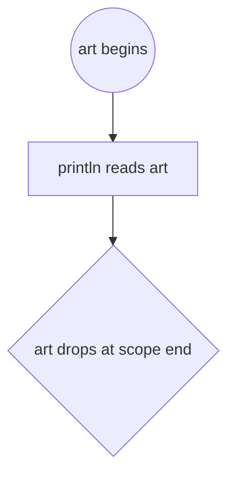
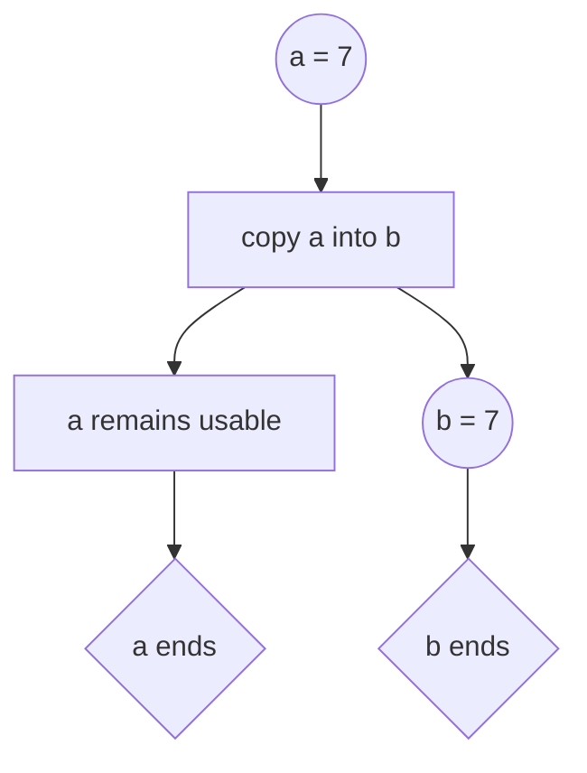
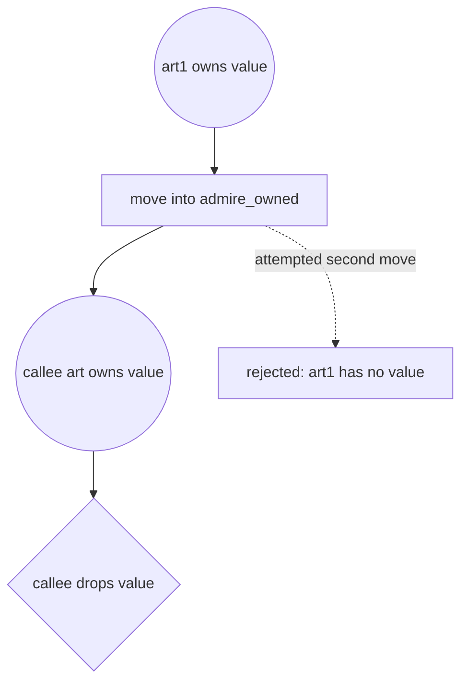
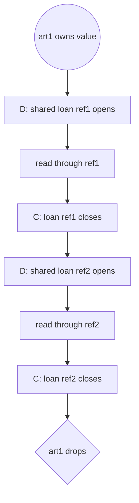
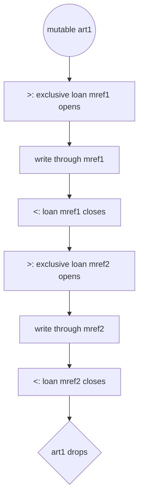
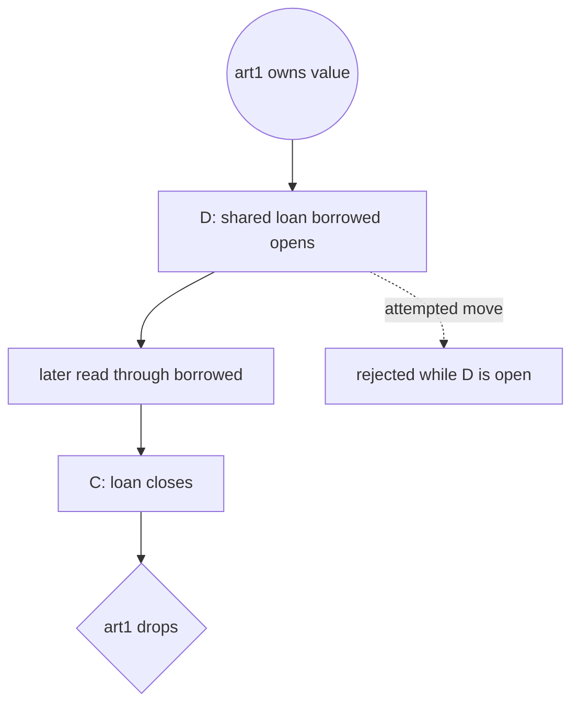
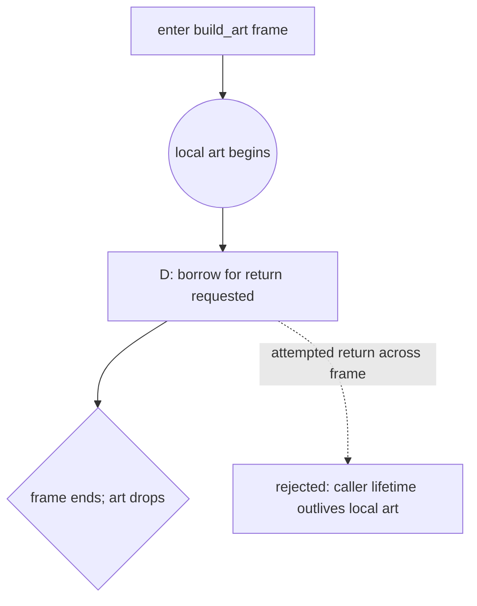

This spike extends the paper method from [Tracing Algorithms](/blog/interview_03_tracing).
It has not been tested with learners; every recommendation below is a teaching
hypothesis rather than a measured result.

## Four operations

Read each row as: “After this statement, `var_b` designates data at the same
address as, at a new address from, or by a reference to `var_a`'s data.”

| Operation | Statement | Data address | Type | Owner of the data | Value in `var_b` | Access after the statement |
|---|---|---|---|---|---|---|
| Move | `let var_b = var_a;` | Same | Same | Now `var_b` | Same bytes | `var_a`: none; `var_b`: full |
| Copy | `let var_b = var_a;` | New | Same | Both, independently | Equal bytes | Both full |
| Borrow | `let var_b = &var_a;` | Same referent | New: `&T` | Still `var_a` | Reference to `var_a` | `var_a`: read; `var_b`: read |
| Mutable borrow | `let var_b = &mut var_a;` | Same referent | New: `&mut T` | Still `var_a` | Reference to `var_a` | `var_a`: none for the loan; `var_b`: read and write |

“Copy” does not always mean “different referent.” References such as `&T` are
themselves `Copy`, so copying one produces another reference to the same
referent. The row above describes copying an ordinary value, such as an
integer or a `Copy` struct.

Every `let` creates a new binding slot, so a separate “binding location”
column would always say “new.” “Data address” instead tracks the data a binding
designates. Rust specifies ownership and access, not whether an optimizer keeps
those bytes at any particular machine address; the address column is a tracing
relationship, not a layout guarantee.

Three time intervals also need distinct names:

- **Binding Scope** the area where the variable can be used in code.
- **Value lifetime** the time from the value being initialized in memory until it has been freed in memory.
- **Borrow active** the region of code that a reference is allowed to be dereferenced.

A reference going out of scope does not destroy its referent. For types such
as `&T`, an end marker means “this binding or borrow is finished,” not that the
resource was dropped.

## Stage 0: what the old T-table misses

Consider a compiling program:

```rust
fn shout(word: String) -> String {
    let mut loud = word;
    loud.push('!');
    loud
}

fn main() {
    let phrase = String::from("hi");
    let result = shout(phrase);
    println!("{result}");
}
```

A language-neutral trace can follow the one allocation and its mutation:

```text
main
  name    | value
  phrase  | 0x10 ------> [ String "hi" ]

  ---------------- shout ----------------
  word    | 0x10 ------> [ String "hi" ]
  loud    | 0x10 ------> [ String "hi!" ]
  return  | 0x10 ------> [ String "hi!" ]
  <--------------- return arrow ---------

  result  | 0x10 ------> [ String "hi!" ]
```

The trace is useful, but incomplete. Its repeated address can look like three
simultaneously usable aliases. Rust says otherwise: `phrase` is unavailable
after the call, `word` is unavailable after `let mut loud = word`, and the
returned value belongs to `result`. Stage 0 therefore preserves the physical
story while failing to record the permission story. That is the gap the
candidate notations must fill.

## Candidate A: an ownership strip in the table

Add a narrow `state` strip to each binding's row. Append marks as the trace
grows; never erase earlier marks.

| Mark | Meaning |
|---|---|
| `O@s1` | This binding owns the value starting at statement 1. |
| `∅@s2` | Its value was moved at statement 2; the binding is no longer usable. |
| `&@s2` / `&m@s2` | A shared / mutable reference was created. |
| crossed-out `*` / `#` | A shared / mutable borrow becomes inactive here. |
| `†@s4` | The binding's lexical scope ends; an owned value is destroyed here. |

```text
main                              s1: let art1 = Artwork { ... };
  name         | value  | state  s2: let borrowed = &art1;
  -----------------------------  s3: println!("{}", borrowed.name);
  art1         | 0x10   | O@s1   *@s2 ~~*@s3~~ †@s4
  borrowed     | &0x10  | &@s2   †@s4
```

This is easy to add to a familiar table and easy to draw incrementally. Its
weakness is visible above: a lifetime is encoded as statement labels to
compare, rather than as a length the reader can see.

## Candidate B: a lifeline graph

Replace the T-table body with an ordinary Mermaid `flowchart`. Each binding,
operation, and end point is a simple node, and edges show how permission or
ownership proceeds down the page. A rejected attempt is a dashed edge to a
labelled rejection node: it is an obligation Rust checks, never an executed
event. Borrow brackets close when the active loan ends, independently of the
reference binding's end node.

### A plain owned value

```rust
fn main() {
    let art = artwork("Owain");
    println!("{}", art.name);
}
```



### A `Copy` value

```rust
fn main() {
    let a: i32 = 7;
    let b = a;
    println!("{a} {b}");
}
```



### Move and use after move

```rust
fn main() {
    let art1 = artwork("Owain");
    admire_owned(art1);
    admire_owned(art1); // rejected
}
```



The dashed edge is the rejected operation, not a second runtime call. There is
no live ownership edge leaving `art1` after the first move.

### Shared and mutable borrows

The shared example uses each reference before creating the next. Its precise
read-only loans are sequential, even though both reference bindings remain in
lexical scope until the closing brace.

```rust
fn main() {
    let art1 = artwork("Owain");
    let ref1 = &art1;
    admire_shared(ref1);
    let ref2 = &art1;
    admire_shared(ref2);
}
```



The mutable example uses two precise, non-overlapping active loans even though
the first reference binding remains in lexical scope.

```rust
fn main() {
    let mut art1 = artwork("Owain");
    let mref1 = &mut art1;
    record_view(&mut *mref1);
    let mref2 = &mut art1;
    record_view(&mut *mref2);
}
```



Borrow brackets close at `C` or `<` when a loan ends; a reference binding's
diamond may appear later when its lexical scope ends.

### A move rejected while borrowed

```rust
fn main() {
    let art1 = artwork("Fire");
    let borrowed = &art1;
    admire_owned(art1); // rejected
    println!("{}", borrowed.name);
}
```



The attempted move is rejected and produces no destination or drop. If it ran,
the reference would outlive its referent, but compiled safe Rust never creates
that runtime state.

### Returning a reference to a local

```rust
fn build_art<'a>() -> &'a Artwork {
    let art = artwork("Liberty");
    &art // rejected return
}
```



The dashed edge is only the proof obligation: Rust rejects returning a
reference to this local, so no dangling reference exists. The generated layout
makes state transitions and rejected attempted edges easy to follow, but it
departs from the original T-table. Exact non-lexical loan endings also require
knowing which use is last. For the teaching approximation, leaving a loan open
to lexical scope end is conservative and avoids back-editing an earlier node.

## Candidate C: a margin ruler

Keep the T-table body and put narrow lifelines in its left margin. Each source
statement adds one horizontal slice to both parts.

| Ruler mark | Meaning |
|---|---|
| `o` | A binding begins. |
| solid stroke | An owning binding still has a value; borrow brackets refine its current access. |
| `.` | A reference binding is usable here. |
| `*` | Ownership moved away; no value is destroyed at this point. |
| `#` | An owned value is destroyed here. |
| `D` / `C` | A shared borrow opens / closes. |
| `>` / `<` | A mutable borrow opens / closes. |
| `:` | Direct access through the owner is suspended by an active mutable borrow. |
| `R` | A reference binding reaches lexical scope end. |
| `?` | The source requests an operation that the ruler says is unavailable. |

The examples below are a compact, reproducible version of the seven-program
set used for the recommendation. Except for the independent `Copy` example,
each `main` is compiled with this common setup:

```rust
struct Artwork {
    name: String,
    view_count: u32,
}

fn artwork(name: &str) -> Artwork {
    Artwork { name: name.to_string(), view_count: 0 }
}

fn admire_owned(art: Artwork) {
    println!("{}", art.name);
}

fn admire_shared(art: &Artwork) {
    println!("{}", art.name);
}

fn record_view(art: &mut Artwork) {
    art.view_count += 1;
}
```

### A plain owned value

```rust
fn main() {
    let art = artwork("Owain");
    println!("{}", art.name);
}
```

```text
art || main
 o  || art | 0x08 ----> [ Artwork { name: "Owain", view_count: 0 } ]
 |  || println!("{}", art.name)
 #  || end of main; art is destroyed
```

### A `Copy` value

```rust
fn main() {
    let a: i32 = 7;
    let b = a;
    println!("{a} {b}");
}
```

```text
a b || main
o   || a | 7
| o || b | 7
| | || println!("{a} {b}")
# # || end of main; two independent values end
```

### Move and use after move

```rust
fn main() {
    let art1 = artwork("Owain");
    admire_owned(art1);
    admire_owned(art1); // error
}
```

```text
art1 art || main
  o      || art1 | 0x10 ----> [ Artwork { name: "Owain" } ]
  *   o  || -------------------------------- admire
      |  || art  | 0x10 ----> [ Artwork { name: "Owain" } ]
      #  || XXXXXXXXXXXXXXXXXXXXXXXXXXXXXXXX admire returns
  ?      || admire_owned(art1)  error: no live value in art1
```

The first call transfers the value. The `*` is not destruction; the `#` in
the callee is where that value would be destroyed. The second call has no
runtime trace because the program does not compile. The `?` records the
borrow checker's rejected operation, not an event that executes.

### Shared and mutable borrows

These are two complete `main` programs using the common setup:

```rust
fn main() {
    let art1 = artwork("Owain");
    let ref1 = &art1;
    admire_shared(ref1);
    let ref2 = &art1;
    admire_shared(ref2);
}
```

```rust
fn main() {
    let mut art1 = artwork("Owain");
    let mref1 = &mut art1;
    record_view(&mut *mref1);
    let mref2 = &mut art1;
    record_view(&mut *mref2);
    println!("{}", art1.view_count);
}
```

```text
art1 ref1 ref2 || shared-borrow program
  o            || art1 | 0x20 ----> [ view_count: 0 ]
  D    o       || ref1 | &0x20 ---> art1
  C    .       || admire_shared(ref1); last use closes first loan
  D    .    o  || ref2 | &0x20 ---> art1
  C    .    .  || admire_shared(ref2); last use closes second loan
  #    R    R  || lexical scope ends; art1 is destroyed
```

```text
art1 mref1 mref2 || mutable-borrow program
  o              || art1 | 0x20 ----> [ view_count: 0 ]
  >     o        || mref1 | &mut 0x20 -> art1
  <     .        || record_view(&mut *mref1); first loan closes, count becomes 1
  >     .     o  || mref2 | &mut 0x20 -> art1
  <     .     .  || record_view(&mut *mref2); second loan closes, count becomes 2
  |     .     .  || println!("{}", art1.view_count)
  #     R     R  || lexical scope ends; art1 is destroyed
```

The reference bindings remain lexically in scope after their last uses, but
their active loans end there. `C` and `<` close those loans; `R` separately
ends the reference bindings. Every binding has its own permanently labelled
column. In a live pen-and-paper trace, close a loan once later code establishes
that the preceding use was the last one. If the exercise forbids all
back-editing, conservatively extend the loan to scope exit and note that the
diagram then approximates Rust's non-lexical lifetime analysis.

### A move rejected while borrowed

```rust
fn main() {
    let art1 = artwork("Fire");
    let borrowed = &art1;
    admire_owned(art1);           // rejected: art1 is borrowed
    println!("{}", borrowed.name);
}
```

```text
art1 borrowed ||
  o           || art1    | 0x30 ----> [ Artwork { name: "Fire" } ]
  D      o    || borrowed | &0x30 ---> art1
  |      .    || admire_owned(art1)  ? move rejected while D is still open
  C      .    || println!("{}", borrowed.name); last use closes loan
  #      R    || end of scope; bindings end and art1 is destroyed
```

Do not draw the move, a callee value, or destruction of the artwork: the
compiler rejects the move, so ownership never transfers. The useful visual
conflict is an attempted move on a row where the shared-borrow span is open.

### Returning a reference to a local

The lifetime parameter below makes the intended (but impossible) promise
explicit: the caller may choose `'a`, yet the function tries to satisfy it
with a local value.

```rust
fn build_art<'a>() -> &'a Artwork {
    let art = artwork("Liberty");
    &art // error: returns a reference to data owned by this function
}

fn main() {
    let _art = build_art();
}
```

```text
art ret || build_art
  o     || art    | 0x40 ----> [ Artwork { name: "Liberty" } ]
  D  o  || return | &0x40 ---> art
  #  ?  || frame ends: art is destroyed, so ret cannot cross this line
```

Again, the failed return is a rejected operation, not a dangling reference
that exists at runtime.

## Candidate D: left-gutter highlighter bands

Candidate D removes the symbol alphabet. Print the source, label a narrow lane
for each binding or borrow in the **left-hand gutter**, and draw a literal
highlighter band from its introduction through the final in-scope source line
before the closing brace. Give each variable a **different highlighter color**
from a small accessible palette. The lane label, source, and geometry remain
the meaning; color only reinforces identity. The source at a band's origin supplies
`&` versus `&mut`; the geometry supplies extent and overlap.

This is a deliberate **conservative lexical subset** of Rust. A **lexical
binding scope** runs to its block's closing brace, while a real **active loan**
may end earlier under non-lexical lifetimes (NLL). Candidate D always extends a
borrow band through the final source line before the brace. It therefore overstates the real active loan and can
report a conflict for code that Rust accepts. That is the intended teaching
simplification: it removes last-use lookahead and later annotation.

**Overlap alone is not an error:** shared loans may overlap. A source line is
rejected only when it crosses a band granting **incompatible access**. A
rejected operation does not execute, so it starts no move, loan, or callee.

Each browser band below is a translucent rectangle, like a highlighter stroke
on paper, rather than a lifetime glyph.

### A plain owned value

<div class="lifetime-gutter" style="--lanes: 1" role="group" aria-label="The art binding band runs from its let statement through the final source line before the closing brace.">
<div class="lifetime-labels"><span>art</span><span>source</span></div>
<pre><span class="lifetime-line"><span aria-hidden="true"></span><code>fn main() {</code></span>
<span class="lifetime-line"><span class="lifetime-band lifetime-start" aria-hidden="true"></span><code>    let art = artwork("Owain");</code></span>
<span class="lifetime-line"><span class="lifetime-band lifetime-end" aria-hidden="true"></span><code>    println!("{}", art.name);</code></span>
<span class="lifetime-line"><span aria-hidden="true"></span><code>}</code></span></pre>
</div>

### A `Copy` value

Both lexical bands reach the final source line before the brace. Their overlap is harmless because the
plain `let b = a` copies an `i32` into two independent values.

<div class="lifetime-gutter" style="--lanes: 2" role="group" aria-label="The a and b binding bands overlap legally after the copy.">
<div class="lifetime-labels"><span>a</span><span>b</span><span>source</span></div>
<pre><span class="lifetime-line"><span aria-hidden="true"></span><span aria-hidden="true"></span><code>fn main() {</code></span>
<span class="lifetime-line"><span class="lifetime-band lifetime-start" aria-hidden="true"></span><span aria-hidden="true"></span><code>    let a: i32 = 7;</code></span>
<span class="lifetime-line"><span class="lifetime-band" aria-hidden="true"></span><span class="lifetime-band lifetime-start" aria-hidden="true"></span><code>    let b = a;</code></span>
<span class="lifetime-line"><span class="lifetime-band lifetime-end" aria-hidden="true"></span><span class="lifetime-band lifetime-end" aria-hidden="true"></span><code>    println!("{a} {b}");</code></span>
<span class="lifetime-line"><span aria-hidden="true"></span><span aria-hidden="true"></span><code>}</code></span></pre>
</div>

### Move and use after move

The `art1` band continues after the successful move because the binding is
still lexically in scope. Candidate D cannot diagnose use after move from
geometry alone; that is an honest limitation of scope-only highlighting.

<div class="lifetime-gutter" style="--lanes: 1" role="group" aria-label="The art1 scope band continues after its value moves, so scope highlighting alone cannot diagnose the second use.">
<div class="lifetime-labels"><span>art1</span><span>source</span></div>
<pre><span class="lifetime-line"><span aria-hidden="true"></span><code>fn main() {</code></span>
<span class="lifetime-line"><span class="lifetime-band lifetime-start" aria-hidden="true"></span><code>    let art1 = artwork("Owain");</code></span>
<span class="lifetime-line"><span class="lifetime-band" aria-hidden="true"></span><code>    admire_owned(art1);</code></span>
<span class="lifetime-line lifetime-rejected"><span class="lifetime-band lifetime-end" aria-hidden="true"></span><code>    admire_owned(art1); // rejected: value moved</code></span>
<span class="lifetime-line"><span aria-hidden="true"></span><code>}</code></span></pre>
</div>

### Shared and mutable borrows

Two `&` bands may overlap through the final source line before the outer brace because both are shared.

<div class="lifetime-gutter" style="--lanes: 2" role="group" aria-label="The ref1 and ref2 shared borrow bands overlap legally through the closing brace.">
<div class="lifetime-labels"><span>ref1</span><span>ref2</span><span>source</span></div>
<pre><span class="lifetime-line"><span aria-hidden="true"></span><span aria-hidden="true"></span><code>fn main() {</code></span>
<span class="lifetime-line"><span aria-hidden="true"></span><span aria-hidden="true"></span><code>    let art1 = artwork("Owain");</code></span>
<span class="lifetime-line"><span class="lifetime-band lifetime-start" aria-hidden="true"></span><span aria-hidden="true"></span><code>    let ref1 = &amp;art1;</code></span>
<span class="lifetime-line"><span class="lifetime-band" aria-hidden="true"></span><span class="lifetime-band lifetime-start" aria-hidden="true"></span><code>    let ref2 = &amp;art1;</code></span>
<span class="lifetime-line"><span class="lifetime-band" aria-hidden="true"></span><span class="lifetime-band" aria-hidden="true"></span><code>    admire_shared(ref1);</code></span>
<span class="lifetime-line"><span class="lifetime-band lifetime-end" aria-hidden="true"></span><span class="lifetime-band lifetime-end" aria-hidden="true"></span><code>    admire_shared(ref2);</code></span>
<span class="lifetime-line"><span aria-hidden="true"></span><span aria-hidden="true"></span><code>}</code></span></pre>
</div>

Sequential mutable borrows use explicit inner blocks. Each `&mut` band reaches
the final source line before its own closing brace, so the lexical bands do not overlap and Rust agrees.

<div class="lifetime-gutter" style="--lanes: 2" role="group" aria-label="The mref1 and mref2 mutable borrow bands occupy separate inner blocks and do not overlap.">
<div class="lifetime-labels"><span>mref1</span><span>mref2</span><span>source</span></div>
<pre><span class="lifetime-line"><span aria-hidden="true"></span><span aria-hidden="true"></span><code>fn main() {</code></span>
<span class="lifetime-line"><span aria-hidden="true"></span><span aria-hidden="true"></span><code>    let mut art1 = artwork("Owain");</code></span>
<span class="lifetime-line"><span aria-hidden="true"></span><span aria-hidden="true"></span><code>    {</code></span>
<span class="lifetime-line"><span class="lifetime-band lifetime-start" aria-hidden="true"></span><span aria-hidden="true"></span><code>        let mref1 = &amp;mut art1;</code></span>
<span class="lifetime-line"><span class="lifetime-band lifetime-end" aria-hidden="true"></span><span aria-hidden="true"></span><code>        record_view(&amp;mut *mref1);</code></span>
<span class="lifetime-line"><span aria-hidden="true"></span><span aria-hidden="true"></span><code>    }</code></span>
<span class="lifetime-line"><span aria-hidden="true"></span><span aria-hidden="true"></span><code>    {</code></span>
<span class="lifetime-line"><span aria-hidden="true"></span><span class="lifetime-band lifetime-start" aria-hidden="true"></span><code>        let mref2 = &amp;mut art1;</code></span>
<span class="lifetime-line"><span aria-hidden="true"></span><span class="lifetime-band lifetime-end" aria-hidden="true"></span><code>        record_view(&amp;mut *mref2);</code></span>
<span class="lifetime-line"><span aria-hidden="true"></span><span aria-hidden="true"></span><code>    }</code></span>
<span class="lifetime-line"><span aria-hidden="true"></span><span aria-hidden="true"></span><code>}</code></span></pre>
</div>

The contrast is an attempted mutable borrow while a shared borrow must remain
live for its later use. Rust rejects the `requested_mut` line. Its second band
is therefore a labelled **proof obligation**—the extent the requested `&mut`
would need—not an executed loan. Because that requested band overlaps the
shared band, the access is illegal under both Candidate D's lexical rule and
actual Rust.

<div class="lifetime-gutter" style="--lanes: 2" role="group" aria-label="The shared borrow band overlaps a requested mutable-borrow proof-obligation band, so Rust rejects the requested mutable borrow; no second loan executes.">
<div class="lifetime-labels"><span>shared &amp;</span><span>requested &amp;mut</span><span>source</span></div>
<pre><span class="lifetime-line"><span aria-hidden="true"></span><span aria-hidden="true"></span><code>fn main() {</code></span>
<span class="lifetime-line"><span aria-hidden="true"></span><span aria-hidden="true"></span><code>    let mut art1 = artwork("Owain");</code></span>
<span class="lifetime-line"><span class="lifetime-band lifetime-start" aria-hidden="true"></span><span aria-hidden="true"></span><code>    let shared = &amp;art1;</code></span>
<span class="lifetime-line lifetime-rejected"><span class="lifetime-band" aria-hidden="true"></span><span class="lifetime-band lifetime-start" aria-hidden="true"></span><code>    let requested_mut = &amp;mut art1; // rejected: shared is still borrowed</code></span>
<span class="lifetime-line"><span class="lifetime-band lifetime-end" aria-hidden="true"></span><span class="lifetime-band lifetime-end" aria-hidden="true"></span><code>    println!("{}", shared.name);</code></span>
<span class="lifetime-line"><span aria-hidden="true"></span><span aria-hidden="true"></span><code>}</code></span></pre>
</div>

### A move rejected while borrowed

The attempted move line crosses the band whose origin is `&art1`, so it asks
for access incompatible with the shared borrow.

<div class="lifetime-gutter" style="--lanes: 1" role="group" aria-label="The borrowed band crosses the attempted move row, so the move is rejected.">
<div class="lifetime-labels"><span>borrowed</span><span>source</span></div>
<pre><span class="lifetime-line"><span aria-hidden="true"></span><code>fn main() {</code></span>
<span class="lifetime-line"><span aria-hidden="true"></span><code>    let art1 = artwork("Fire");</code></span>
<span class="lifetime-line"><span class="lifetime-band lifetime-start" aria-hidden="true"></span><code>    let borrowed = &amp;art1;</code></span>
<span class="lifetime-line lifetime-rejected"><span class="lifetime-band" aria-hidden="true"></span><code>    admire_owned(art1); // rejected: art1 is borrowed</code></span>
<span class="lifetime-line"><span class="lifetime-band lifetime-end" aria-hidden="true"></span><code>    println!("{}", borrowed.name);</code></span>
<span class="lifetime-line"><span aria-hidden="true"></span><code>}</code></span></pre>
</div>

### Returning a reference to a local

The local `art` band ends on the return expression before the function brace. The return type would require
the separately labelled `required 'a` band to continue into the caller, so
containment fails. That band is a proof obligation, not a runtime dangling
reference.

<div class="lifetime-gutter" style="--lanes: 2" role="group" aria-label="The required caller lifetime extends below the local art band, so the return is rejected.">
<div class="lifetime-labels"><span>art</span><span>required 'a</span><span>source</span></div>
<pre><span class="lifetime-line"><span aria-hidden="true"></span><span aria-hidden="true"></span><code>fn build_art&lt;'a&gt;() -&gt; &amp;'a Artwork {</code></span>
<span class="lifetime-line"><span class="lifetime-band lifetime-start" aria-hidden="true"></span><span aria-hidden="true"></span><code>    let art = artwork("Liberty");</code></span>
<span class="lifetime-line lifetime-rejected"><span class="lifetime-band lifetime-end" aria-hidden="true"></span><span class="lifetime-band lifetime-start" aria-hidden="true"></span><code>    &amp;art // rejected return</code></span>
<span class="lifetime-line"><span aria-hidden="true"></span><span class="lifetime-band" aria-hidden="true"></span><code>}</code></span>
<span class="lifetime-line"><span aria-hidden="true"></span><span class="lifetime-band lifetime-end" aria-hidden="true"></span><code>caller would still require the reference here</code></span></pre>
</div>

## Candidate CD: highlighted ruler plus memory trace

Candidate CD combines Candidate D's literal lexical highlighter bands with
Candidate C's transitions as geometry in those same left-gutter lanes. Paired with that annotated
source, the **Tracing Algorithms** `traceDiagram` shows frames, rows, and heap
values. The two views answer different questions: the gutter shows when names
and requested permissions overlap; the memory view shows where a value would
live, move, and be destroyed.

For teaching, lexical scope is the intentional teaching simplification. Pull
each local band from its introduction through the final in-scope source line
before the closing brace, even though Rust's
non-lexical lifetime analysis can accept shorter loans. A band's visible ends
already show where a binding begins and ends, so the gutter needs no start or
drop glyphs. Unrelated bindings retain whitespace between their highlighter
strokes. An owner and the references derived from it instead touch edge to edge,
forming stepped colored blocks with no whitespace between them: a stacked
pyramid on its side. A move terminates its owner band at the call; a short
horizontal cap makes the transfer explicit. Each labelled variable
gets a different highlighter color from the accessible palette. During a mutable
loan, the owner's yellow band becomes hatched and dashed, so color is never the
only carrier of meaning.

### A plain owned value

The one yellow band begins where `art` is declared and ends on the final
in-scope source line. Its rounded endpoints carry all the necessary start and
end information; the memory view connects the local binding to its heap value.

<div class="lifetime-composite" role="group" aria-label="A plain owned value shown with a lexical gutter and a Tracing Algorithms memory diagram.">
<div class="lifetime-gutter lifetime-gutter-geometry" style="--lanes: 1" role="group" aria-label="The art band runs from its declaration through the final source line, where the owned value is destroyed.">
<div class="lifetime-labels"><span>art</span><span>source</span></div>
<pre><span class="lifetime-line"><span aria-hidden="true"></span><code>fn main() {</code></span>
<span class="lifetime-line"><span class="lifetime-band lifetime-start" aria-hidden="true"></span><code>    let art = artwork("Owain");</code></span>
<span class="lifetime-line"><span class="lifetime-band lifetime-end" aria-hidden="true"></span><code>    println!("{}", art.name);</code></span>
<span class="lifetime-line"><span aria-hidden="true"></span><code>}</code></span></pre>
</div>
<pre class="mermaid" aria-label="Tracing Algorithms memory view of a plain owned value.">traceDiagram
  title A plain owned value
  heap artwork 0x08
    name: Owain
    view_count: 0
  end
  frame main
    art: @artwork
    watch art.name: Owain
    done
  end</pre>
</div>

### A `Copy` value

The yellow `a` band and blue `b` band overlap legally: copying an `i32` creates
two independent values. Both bands end on the final in-scope source line.

<div class="lifetime-composite" role="group" aria-label="Two Copy values shown with differently colored gutters and a Tracing Algorithms memory diagram.">
<div class="lifetime-gutter lifetime-gutter-geometry" style="--lanes: 2" role="group" aria-label="The a and b bands overlap legally after b receives its own copied value.">
<div class="lifetime-labels"><span>a</span><span>b</span><span>source</span></div>
<pre><span class="lifetime-line"><span aria-hidden="true"></span><span aria-hidden="true"></span><code>fn main() {</code></span>
<span class="lifetime-line"><span class="lifetime-band lifetime-start" aria-hidden="true"></span><span aria-hidden="true"></span><code>    let a: i32 = 7;</code></span>
<span class="lifetime-line"><span class="lifetime-band" aria-hidden="true"></span><span class="lifetime-band lifetime-start" aria-hidden="true"></span><code>    let b = a;</code></span>
<span class="lifetime-line"><span class="lifetime-band lifetime-end" aria-hidden="true"></span><span class="lifetime-band lifetime-end" aria-hidden="true"></span><code>    println!("{a} {b}");</code></span>
<span class="lifetime-line"><span aria-hidden="true"></span><span aria-hidden="true"></span><code>}</code></span></pre>
</div>
<pre class="mermaid" aria-label="Tracing Algorithms memory view of two independent Copy values.">traceDiagram
  title Copy creates independent values
  frame main
    a: 7
    b: 7
    watch println a b: 7 7
    done
  end</pre>
</div>

### Move and use after move

“Use after free” is useful shorthand for the danger, but safe Rust rejects the
second use before such a runtime state exists. The yellow `art1` band ends at
the first `admire_owned(art1)` because that call moves the value. A horizontal
move cap marks the transfer; no callee band is needed. The rejected second call
has no band because `art1` no longer owns a value.

<div class="lifetime-composite" role="group" aria-label="Use after move shown as a terminating owner gutter beside a Tracing Algorithms ownership and memory diagram.">
<div class="lifetime-gutter lifetime-gutter-geometry" style="--lanes: 1" role="group" aria-label="The art1 band begins at its declaration and ends at the first admire_owned call because ownership moves there; the second call is rejected.">
<div class="lifetime-labels"><span>art1</span><span>source</span></div>
<pre><span class="lifetime-line"><span aria-hidden="true"></span><code>fn main() {</code></span>
<span class="lifetime-line"><span class="lifetime-band lifetime-start" aria-hidden="true"></span><code>    let art1 = artwork("Owain");</code></span>
<span class="lifetime-line"><span class="lifetime-band lifetime-end" aria-hidden="true"></span><span class="lifetime-move-terminal" aria-hidden="true"></span><code>    admire_owned(art1);</code></span>
<span class="lifetime-line lifetime-rejected"><span aria-hidden="true"></span><code>    admire_owned(art1); // rejected: already moved</code></span>
<span class="lifetime-line"><span aria-hidden="true"></span><code>}</code></span></pre>
</div>
<pre class="mermaid" aria-label="Tracing Algorithms memory view of the accepted move and rejected second use.">traceDiagram
  title Ownership check for use after move
  heap artwork 0x10
    state: alive, freed by admire_owned
  end
  frame main
    art1: @artwork, moved
    watch first admire_owned: accepted, moves art1
    frame admire_owned
      art: @artwork
      done
    end
    watch second admire_owned: rejected
  end</pre>
</div>

The source name remains lexically in scope, but its ownership band has ended.
The memory diagram supplies the callee-frame detail without adding a misleading
second gutter lane. Together they distinguish scope, ownership, and value lifetime.

### Shared borrows

The owner and both reference bindings have distinct colors. Under the lexical
teaching rule, each reference band continues to the final in-scope source line;
their overlap is legal because both request shared access. Because the owner
and reference bands touch, each new reference adds another step to the sideways
pyramid without needing a separate connector.

<div class="lifetime-composite" role="group" aria-label="Two legal shared borrows shown as a touching sideways pyramid of differently colored gutters with a Tracing Algorithms memory diagram.">
<div class="lifetime-gutter lifetime-gutter-geometry lifetime-gutter-connected" style="--lanes: 3" role="group" aria-label="The touching art1, ref1, and ref2 bands overlap through the final source line and form a sideways pyramid.">
<pre><span class="lifetime-line"><span aria-hidden="true"></span><span aria-hidden="true"></span><span aria-hidden="true"></span><code>fn main() {</code></span>
<span class="lifetime-line"><span class="lifetime-band lifetime-start" aria-hidden="true"></span><span aria-hidden="true"></span><span aria-hidden="true"></span><code>    let art1 = artwork("Owain");</code></span>
<span class="lifetime-line"><span class="lifetime-band" aria-hidden="true"></span><span class="lifetime-band lifetime-start" aria-hidden="true"></span><span aria-hidden="true"></span><code>    let ref1 = &amp;art1;</code></span>
<span class="lifetime-line"><span class="lifetime-band" aria-hidden="true"></span><span class="lifetime-band" aria-hidden="true"></span><span class="lifetime-band lifetime-start" aria-hidden="true"></span><code>    let ref2 = &amp;art1;</code></span>
<span class="lifetime-line"><span class="lifetime-band" aria-hidden="true"></span><span class="lifetime-band" aria-hidden="true"></span><span class="lifetime-band" aria-hidden="true"></span><code>    admire_shared(ref1);</code></span>
<span class="lifetime-line"><span class="lifetime-band lifetime-end" aria-hidden="true"></span><span class="lifetime-band lifetime-end" aria-hidden="true"></span><span class="lifetime-band lifetime-end" aria-hidden="true"></span><code>    admire_shared(ref2);</code></span>
<span class="lifetime-line"><span aria-hidden="true"></span><span aria-hidden="true"></span><span aria-hidden="true"></span><code>}</code></span></pre>
</div>
<pre class="mermaid" aria-label="Tracing Algorithms memory view of two compatible shared references.">traceDiagram
  title Compatible shared borrows
  heap artwork 0x20
    name: Owain
    view_count: 0
  end
  frame main
    art1: @artwork
    ref1: &amp;0x20
    ref2: &amp;0x20
    watch admire_shared ref1: allowed
    watch admire_shared ref2: allowed
    done
  end</pre>
</div>

### Mutable borrows

Each mutable reference lives in its own inner block. The blue `mref1` and pink
`mref2` bands therefore never overlap; each runs from its declaration through
the final source line before its own closing brace. The touching blocks alone
show each step away from the owner. While either mutable loan is active, the owner's yellow
band switches to a hatched fill with dashed edges, showing that direct owner
access is suspended.

<div class="lifetime-composite" role="group" aria-label="Two sequential mutable borrows shown as touching differently colored gutter blocks with a Tracing Algorithms memory diagram.">
<div class="lifetime-gutter lifetime-gutter-geometry lifetime-gutter-connected" style="--lanes: 3" role="group" aria-label="The touching art1 owner and mutable-reference bands form stepped blocks; art1 becomes hatched during each mutable loan, while mref1 and mref2 occupy separate non-overlapping blocks.">
<pre><span class="lifetime-line"><span aria-hidden="true"></span><span aria-hidden="true"></span><span aria-hidden="true"></span><code>fn main() {</code></span>
<span class="lifetime-line"><span class="lifetime-band lifetime-start" aria-hidden="true"></span><span aria-hidden="true"></span><span aria-hidden="true"></span><code>    let mut art1 = artwork("Owain");</code></span>
<span class="lifetime-line"><span class="lifetime-band" aria-hidden="true"></span><span aria-hidden="true"></span><span aria-hidden="true"></span><code>    {</code></span>
<span class="lifetime-line"><span class="lifetime-band lifetime-suspended" aria-hidden="true"></span><span class="lifetime-band lifetime-start" aria-hidden="true"></span><span aria-hidden="true"></span><code>        let mref1 = &amp;mut art1;</code></span>
<span class="lifetime-line"><span class="lifetime-band lifetime-suspended" aria-hidden="true"></span><span class="lifetime-band lifetime-end" aria-hidden="true"></span><span aria-hidden="true"></span><code>        record_view(&amp;mut *mref1);</code></span>
<span class="lifetime-line"><span class="lifetime-band" aria-hidden="true"></span><span aria-hidden="true"></span><span aria-hidden="true"></span><code>    }</code></span>
<span class="lifetime-line"><span class="lifetime-band" aria-hidden="true"></span><span aria-hidden="true"></span><span aria-hidden="true"></span><code>    {</code></span>
<span class="lifetime-line"><span class="lifetime-band lifetime-suspended" aria-hidden="true"></span><span aria-hidden="true"></span><span class="lifetime-band lifetime-start" aria-hidden="true"></span><code>        let mref2 = &amp;mut art1;</code></span>
<span class="lifetime-line"><span class="lifetime-band lifetime-suspended" aria-hidden="true"></span><span aria-hidden="true"></span><span class="lifetime-band lifetime-end" aria-hidden="true"></span><code>        record_view(&amp;mut *mref2);</code></span>
<span class="lifetime-line"><span class="lifetime-band lifetime-end" aria-hidden="true"></span><span aria-hidden="true"></span><span aria-hidden="true"></span><code>    }</code></span>
<span class="lifetime-line"><span aria-hidden="true"></span><span aria-hidden="true"></span><span aria-hidden="true"></span><code>}</code></span></pre>
</div>
<pre class="mermaid" aria-label="Tracing Algorithms memory view of two sequential mutable loans.">traceDiagram
  title Sequential mutable borrows
  heap artwork 0x20
    name: Owain
    view_count: 0, 1, 2
  end
  frame main
    art1: @artwork
    scope first mutable loan
      mref1: &amp;mut 0x20
      watch view_count: 1
      done
    end
    scope second mutable loan
      mref2: &amp;mut 0x20
      watch view_count: 2
      done
    end
    done
  end</pre>
</div>

### A move rejected while borrowed

The blue `borrowed` band remains open across the attempted move and touches the
yellow `art1` band as its next outward step. Because the blue band crosses the bold rejected
call, the attempted move cannot terminate the owner band. Rust rejects the
operation before it can create a callee or runtime state.

<div class="lifetime-composite" role="group" aria-label="A move rejected during a shared borrow shown with touching differently colored gutters and a Tracing Algorithms memory diagram.">
<div class="lifetime-gutter lifetime-gutter-geometry lifetime-gutter-connected" style="--lanes: 2" role="group" aria-label="The touching art1 and borrowed bands form a step; the borrowed band crosses the attempted move row, so the move from art1 is rejected while the shared loan remains open.">
<pre><span class="lifetime-line"><span aria-hidden="true"></span><span aria-hidden="true"></span><code>fn main() {</code></span>
<span class="lifetime-line"><span class="lifetime-band lifetime-start" aria-hidden="true"></span><span aria-hidden="true"></span><code>    let art1 = artwork("Fire");</code></span>
<span class="lifetime-line"><span class="lifetime-band" aria-hidden="true"></span><span class="lifetime-band lifetime-start" aria-hidden="true"></span><code>    let borrowed = &amp;art1;</code></span>
<span class="lifetime-line lifetime-rejected"><span class="lifetime-band" aria-hidden="true"></span><span class="lifetime-band" aria-hidden="true"></span><code>    admire_owned(art1); // rejected: art1 is borrowed</code></span>
<span class="lifetime-line"><span class="lifetime-band lifetime-end" aria-hidden="true"></span><span class="lifetime-band lifetime-end" aria-hidden="true"></span><code>    println!("{}", borrowed.name);</code></span>
<span class="lifetime-line"><span aria-hidden="true"></span><span aria-hidden="true"></span><code>}</code></span></pre>
</div>
<pre class="mermaid" aria-label="Tracing Algorithms memory view of a move rejected during a shared borrow.">traceDiagram
  title Move rejected while borrowed
  heap artwork 0x30
    name: Fire
    view_count: 0
  end
  frame main
    art1: @artwork
    borrowed: &amp;0x30
    watch admire_owned art1: rejected
    watch borrowed.name: Fire
    done
  end</pre>
</div>

### Returning a stack pointer: Rust's returned local reference

“Return a stack pointer” is the familiar systems-programming failure. In safe
Rust, the analogous source tries to return a reference to a stack-local value.
The yellow `art` band ends on the `&art` line before the function brace, while
the blue `caller 'a` band continues to just after it. The blue block extends
beyond the yellow owner instead of folding back into it, exposing the failed
containment directly. Rust rejects this before a dangling runtime state exists.

<div class="lifetime-composite" role="group" aria-label="A returned local reference shown as touching differently colored gutter blocks with a Tracing Algorithms memory diagram.">
<div class="lifetime-gutter lifetime-gutter-geometry lifetime-gutter-connected" style="--lanes: 2" role="group" aria-label="The touching art and caller 'a bands form an outward step; the blue caller block extends beyond the yellow owner, so the return is rejected.">
<pre><span class="lifetime-line"><span aria-hidden="true"></span><span aria-hidden="true"></span><code>fn build_art&lt;'a&gt;() -&gt; &amp;'a Artwork {</code></span>
<span class="lifetime-line"><span class="lifetime-band lifetime-start" aria-hidden="true"></span><span aria-hidden="true"></span><code>    let art = artwork("Liberty");</code></span>
<span class="lifetime-line lifetime-rejected"><span class="lifetime-band lifetime-end" aria-hidden="true"></span><span class="lifetime-band lifetime-start" aria-hidden="true"></span><code>    &amp;art // rejected return</code></span>
<span class="lifetime-line"><span aria-hidden="true"></span><span class="lifetime-band" aria-hidden="true"></span><code>}</code></span>
<span class="lifetime-line"><span aria-hidden="true"></span><span class="lifetime-band lifetime-end" aria-hidden="true"></span><code>caller would require the reference here</code></span></pre>
</div>
<pre class="mermaid" aria-label="Tracing Algorithms memory view of the rejected returned local reference.">traceDiagram
  title Static check of a returned local reference
  frame build_art
    art: Artwork Liberty
    watch requested return: rejected
    done
  end</pre>
</div>

The memory view makes the frame boundary concrete: `art` belongs to
`build_art`. The gutter makes the failed containment concrete: the requested
reference extent is longer than the local's extent. There is no returned
pointer row because no return executes.

Candidate CD remains a statement-by-statement paper method whose
meaning survives without its reinforcing palette. It has
not been tested with learners.

## Draw order and recommendation

Candidate CD is the synthesis to test first. Draw each lexical band from a
binding's introduction through its final in-scope source line. End an owner's
band at a move, use touching stepped bands for references derived from that
owner, and use the memory diagram when a frame boundary, move, or destruction
site matters. Candidate B makes
state transitions explicit as generated nodes and edges; C and D remain useful
isolated experiments; CD puts their complementary evidence in one view.

The lexical rule remains an intentional approximation. Precise non-lexical
loan endings require lookahead or later annotation, while CD conservatively
highlights to the end of the lexical scope. Invalid operations remain rejected
proof obligations rather than runtime moves, frees, or dangling references.

## What to test

Give learners the seven examples without compiler results. Ask them to draw the
gutter and memory view, predict whether each program compiles, and point to the
specific overlap, ownership endpoint, or frame boundary that decides it. Record
correctness, drawing time, back-editing, and which view supplied the answer.

In particular, compare the returned-local and use-after-move examples with and
without the paired memory diagram. The recommendation remains untested until
readers can explain both why Rust rejects the operation and which unsafe runtime
state the rejection prevents.
