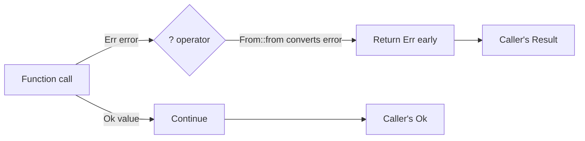
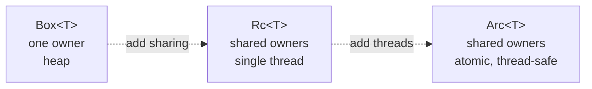

# What This Lecture Is Really About

## The compiler refuses to let you defer decisions you're used to deferring

---

## Today's Map

**Foundations**
- Pattern matching
- Error propagation
- Iterators

+++

**Building blocks**
- From / Into
- Box, Rc, Arc
- Clone, the honest way
- Derive

---

# Pattern Matching

## Exhaustive Semantic Branches

---

```rust
enum Shape {
    Circle { radius: f64 },
    Rectangle {
        width: f64,
        height: f64,
    },
}
```

+++

```rust
fn area(shape: &Shape) -> f64 {
    match shape {
        Shape::Circle { radius } =>
            std::f64::consts::PI
                * radius * radius,
        Shape::Rectangle { width, height } =>
            width * height,
    }
}
```

<!--
- No `default:` arm
- Add a variant to `Shape`
- The compiler names the
  missing arm, at compile time
- `Option` and `Result` are
  just enums. This is why
  they work the way they do.
-->

---

# Error Propagation

## `Option`, `Result`, `Error` trats and `?` operator

---

## `Option<T>`

```rust
fn find_user(id: u64, users: &[User]) -> Option<&User> {
    users.iter().find(|u| u.id == id)
}

ship_to(find_user(42, users).address); // ⛔️
find_user(42, users).map(|u| ship_to(u.address))?; // ✅
match find_user(42, users) {
    Some(user) => ship_to(u.address),
    None => warn!(userid=42, "No user found for shipping"),
}
```
---

## `Result<T, E>`

```rust
fn parse_port(input: &str) -> Result<u16, std::num::ParseIntError> {
    let port: u16 = input.parse()?;
    Ok(port)
}
```

* No `try` / `catch`.
* No stack unwinding.
* `?` operator returns errors early.

---

## Typed Errors: Library Side

```rust
use thiserror::Error;

#[derive(Error, Debug)]
enum ConfigError {
    #[error("missing field: {0}")]
    MissingField(String),
    #[error("io error: {0}")]
    Io(#[from] std::io::Error),
}
```

* `thiserror` for libraries & internals.
* Callers match on the variant they got.
* Enum matching guarantees exhaustive.

---

## Typed Errors: Application Side

```rust
use anyhow::{Context, Result};

fn load_config(path: &str) -> Result<Config> {
    let text = std::fs::read_to_string(path)
        .with_context(|| format!("failed to read {path}"))?;
    parse_config(&text)
}
```

* `anyhow` for applications & edge.
* Propagate with context.
* Opaque and non-exhaustive.

---

## Error Handling Flow



---

# Iterators

## `Iterator`, `IntoIterator`, `Iter`, `IntoIter`

---

## Three Ways In

```mermaid
flowchart TD
    V[Vec&lt;T&gt;] -->|.iter&#40;&#41;| I1["Iterator&lt;Item = &T&gt;<br/>borrows"]
    V -->|.iter_mut&#40;&#41;| I2["Iterator&lt;Item = &mut T&gt;<br/>borrows mutably"]
    V -->|.into_iter&#40;&#41;| I3["Iterator&lt;Item = T&gt;<br/>consumes"]
```



---

## Use After Move

```mermaid
code: rust
let v = vec![1, 2, 3];
for x in v { // x is u32
    println!("{x}");
}
println!("{v:?}");
// error[E0382]:
// use of moved value: `v`
marks:
v: 1, 2
x: 2, 3
```
+++

```mermaid
code: rust
let v = vec![1, 2, 3];
for x in &v { // x is &u32
    println!("{x}");
}
println!("{v:?}");
// v still owned here
marks:
v: 1,5
x &v: 2,3
```

---

## Iterator Methods

```rust
let v = vec![1, 2, 3];
let d = v.iter().map(|a| a * 2).collect();
let o = v.iter().filter(|a| a % 2 == 0).collect();
let s = v.iter().fold(|a, b| a + b);
```

---

# Data Conversion

## `From` and `Into`

---

## Implement `From`, `Into` is Free

```rust
struct UserId(u64);
struct OrderId(u64);

impl From<u64> for UserId {
    fn from(raw: u64) -> Self {
        UserId(raw)
    }
}

let uid: UserId = 42.into();
```

Never implement `Into` directly. The blanket implementation covers it.

---

## Newtype

```rust
fn charge(order: OrderId, user: UserId) { /* ... */ }

charge(7, 32);
charge(OrderId(7), UserId(32));
charge(UserId(32), OrderId(7));
```

Swap the argument order and it fails to compile, not fails in
production. `UserId` and `OrderId` are both `u64` underneath. The
compiler no longer sees them as the same type.

---

## `From` and `?`

`?` in section 3.2 calls `From::from` on the error type. That is
why typed errors compose across layers instead of requiring a
manual wrap at every call site.

---

# Managed References

## `Box`, `Rc`, `Arc`

---

## `Box<T>`: Single Ownership

```rust
enum Tree {
    Leaf(i32),
    Node(Box<Tree>, Box<Tree>),
}
```

Heap-allocated, one owner. Recall lecture 2: `dyn Trait` is dynamic
dispatch, a vtable. `Box<dyn Error>` is that, plus heap allocation.

---

## `Rc<T>`: Shared, Single-Threaded

```rust
use std::rc::Rc;

let shared = Rc::new(vec![1, 2, 3]);
let a = Rc::clone(&shared);
let b = Rc::clone(&shared);

println!("refcount: {}", Rc::strong_count(&shared));
// 3
```

---

## `Arc<T>`: Shared, Thread-Safe

```rust
use std::sync::Arc;
use std::thread;

let shared = Arc::new(vec![1, 2, 3]);
let handle = {
    let shared = Arc::clone(&shared);
    thread::spawn(move || println!("{shared:?}"))
};
handle.join().unwrap();
```

---

## Ownership at a Glance



---

# `Clone` isn't free

---

## Resist, Then Prefer

**Resist**
```rust
fn total(prices: &Vec<f64>) -> f64 {
    let prices = prices.clone();
    // dodging a borrow
    // error elsewhere
    prices.iter().sum()
}
```

+++

**Prefer**
```rust
fn total(prices: &[f64]) -> f64 {
    prices.iter().sum()
}
```

`Rc::clone(&shared)` two slides back is the acceptable case: cheap,
a pointer clone. Cloning a `Vec<f64>` is not. The compiler will not
tell you which one you just wrote.

---

# `Derive` et al.

---

## Compiler Busywork

```rust
#[derive(Debug, Clone, PartialEq, Default)]
struct Point {
    x: i32,
    y: i32,
}

let a = Point::default();
let b = a.clone();
assert_eq!(a, b);
println!("{a:?}");
```

In Java, this is `equals`, half of `hashCode`, `toString`, and a no-arg constructor.
In Python, this is `@dataclass`, with a few things missing.

---

# Put it all together...

---

```rust
use std::rc::Rc;
use thiserror::Error;

#[derive(Error, Debug)]
enum LoadError {
    #[error("io error: {0}")]
    Io(#[from] std::io::Error),
}

#[derive(Debug, Clone, Default)]
struct Config {
    hosts: Vec<String>,
}

fn load_hosts(paths: &[String]) -> Result<Rc<Config>, LoadError> {
    let mut hosts = Vec::new();
    for path in paths.iter() {
        let text = std::fs::read_to_string(path)?;
        match text.trim() {
            "" => continue,
            host => hosts.push(host.to_string()),
        }
    }
    Ok(Rc::new(Config { hosts }))
}
```

---

## What's In There

- `derive` on `Config`
- `?` and `From`, converting
  `io::Error` into `LoadError`
- `.iter()`, borrowing `paths`

+++

- `match` on the trimmed line
- `Rc`, sharing the result instead of cloning it

---

# Questions
